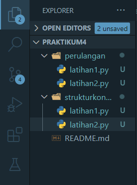
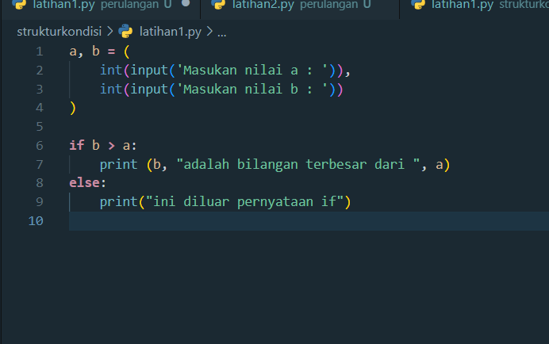
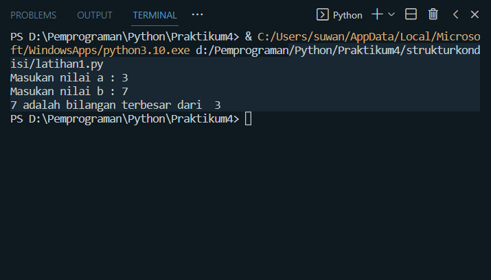
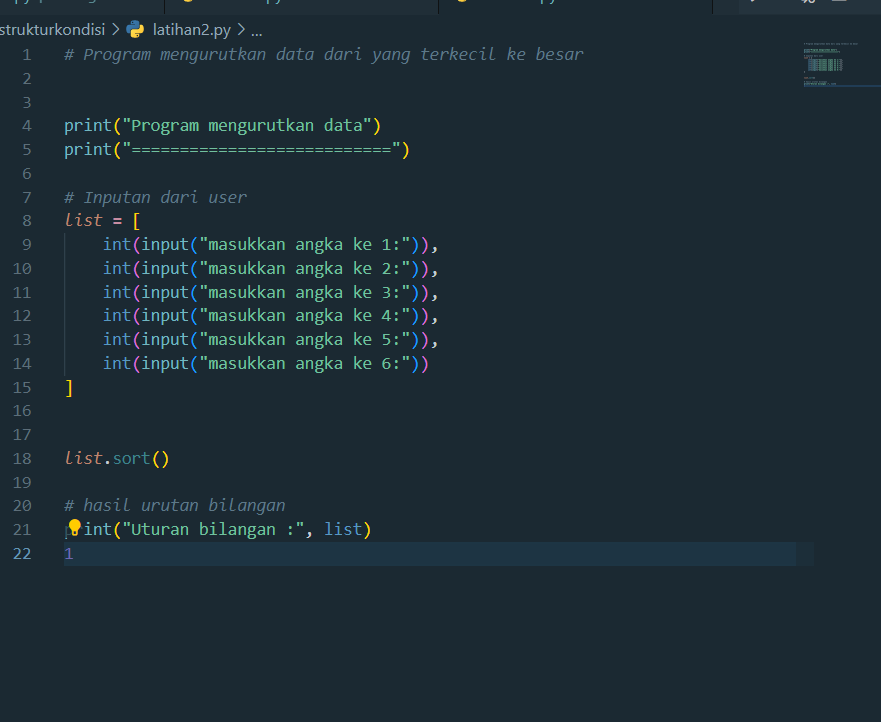
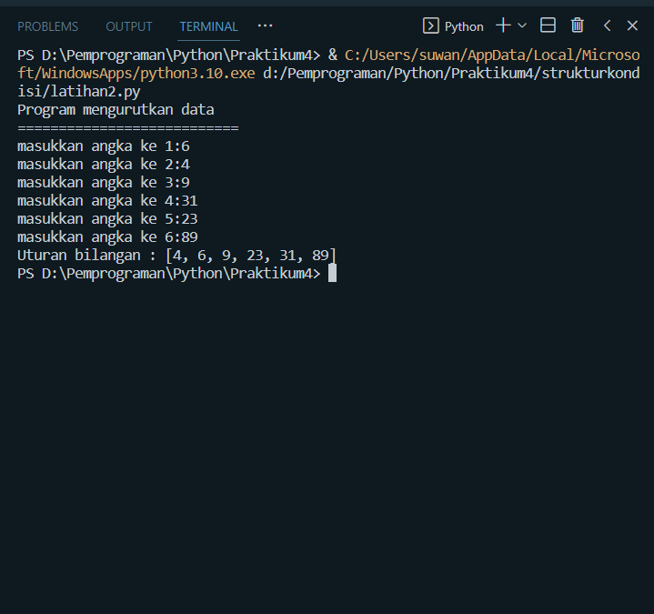
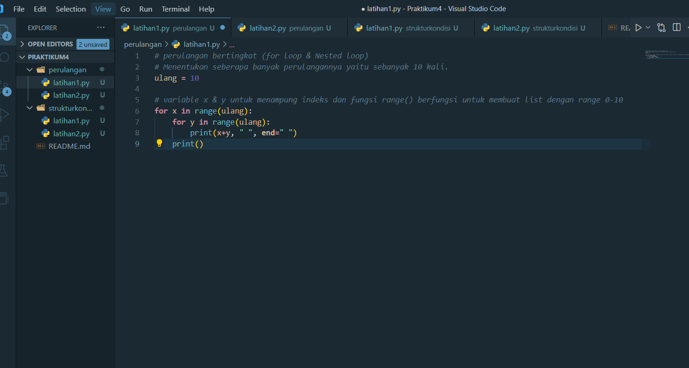
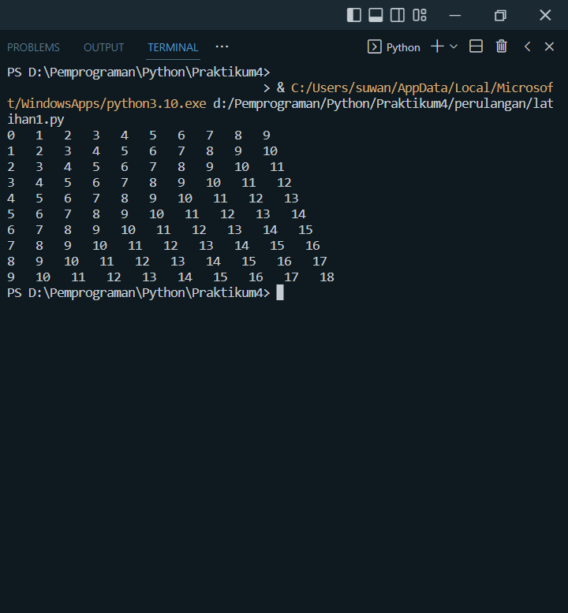
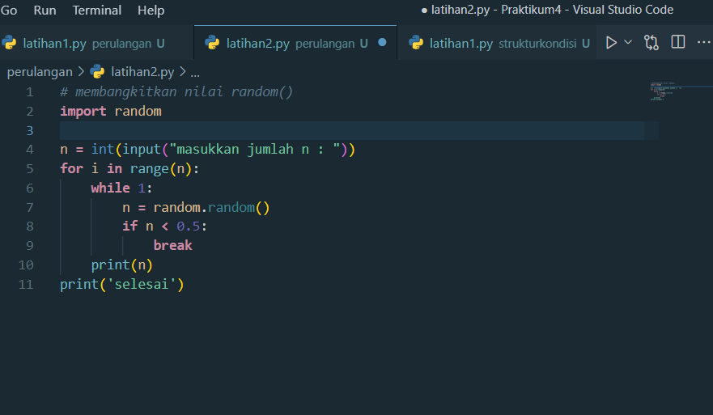
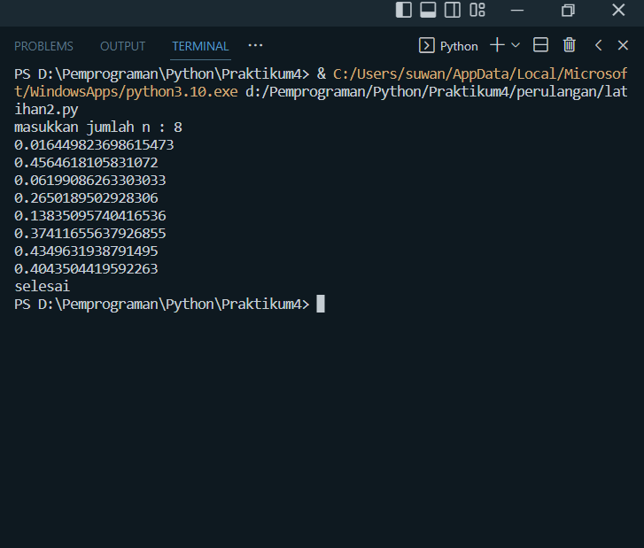

# Praktikum4 Bahasa pemrograman python
### Belajar Struktur kondisi dan perulangan pada Python

1. Buat folder dengan nama Praktikum4 lalu didalamnya kita buat dua folder yaitu `struktur-kondisi` &` perulangan`  dan didalamnya buat file` Latihan1.py` dan` Latihan2.py` dimasing masing folder . berikut contohnya :

  `NOTE : kalian bebas menamakan folder dan filenya`
    

2. Selanjutnya kita buka file `struktur-kondisi` >` Latihan1.py`... lalu isikan codingan berikut :

   ```python
     a, b = (
    int(input('Masukan nilai a : ')),
    int(input('Masukan nilai b : '))
    )

     if b > a:
    print (b, "adalah bilangan terbesar dari ", a)
    else:
    print("ini diluar pernyataan if")
    
   ```
   Jika sudah lalu kita jalankan dengan cara ketikan diterminal yaitu `python Latihan1.py` !!! perlu diingat kita harus berada didirektor `strukturkondisi`. Lalu akan tampil hasilnya seperti dibawah ini

    
    


3. Selanjutnya kita buka `Latihan2.py` pada folder `struktur-kondisi` lalu ketikan codingan berikut :

   ```python
      # Program mengurutkan data dari yang terkecil ke besar


      print("Program mengurutkan data")
      print("===========================")

    # Inputan dari user
    list = [
       int(input("masukkan angka ke 1:")),
       int(input("masukkan angka ke 2:")),
       int(input("masukkan angka ke 3:")),
       int(input("masukkan angka ke 4:")),
       int(input("masukkan angka ke 5:")),
       int(input("masukkan angka ke 6:"))
        ]


     list.sort()

     # hasil urutan bilangan
      print("Uturan bilangan :", list)
      1 

   ```
 Lalu akan tampil hasilnya seperti dibawah ini
     
     
4. Selanjutnya kita buka `Latihan2.py` pada folder `perulangan` lalu ketikan codingan berikut : 

```python
# perulangan bertingkat (for loop & Nested loop)
# Menentukan seberapa banyak perulangannya yaitu sebanyak 10 kali.
ulang = 10

# variable x & y untuk menampung indeks dan fungsi range() berfungsi untuk membuat list dengan range 0-10
for x in range(ulang):
    for y in range(ulang):
        print(x+y, " ", end=" ")
    print()
```
Lalu akan tampil hasilnya seperti dibawah ini
    
 


    
    
    
 5. Selanjutnya kita buka `Latihan2.py` pada folder `perulangan` lalu ketikan codingan berikut :

   ```python
 
     # membangkitkan nilai random()
     import random

      n = int(input("masukkan jumlah n : "))
     for i in range(n):
        while 1:
           n = random.random()
          if n < 0.5:
              break
        print(n)
     print('selesai')

   ```
Lalu akan tampil hasilnya seperti dibawah ini




    
__________________
  TERIMA KASIH